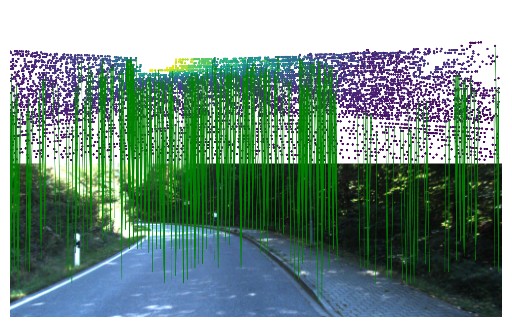

## CorrI2P: Deep Image-to-Point Cloud Registration via Dense Correspondence  
  
  
### Data  
Here we would provide KITTI prepared.  
You can download it [here](https://tjueducn-my.sharepoint.com/:f:/g/personal/rsy6318_tju_edu_cn/Ejuy4n_OeuFPkayDWnOwRmgBRnR2z_pltD2uv0F6LHYN_Q?e=7506Ug)
  
  
### Usage
Install required lib as SO-Net or [DeepI2P](https://github.com/lijx10/DeepI2P/tree/main/models/index_max_ext).
#### Train
```
python train.py
```
#### Test
```
python eval_all.py
python cal_error_all.py
python analysis.py
```
Note: There would be lots of intermediate results, please leave enough storage space.  
  
We thank the authors of [DeepI2P](https://github.com/lijx10/DeepI2P) for their public code.
